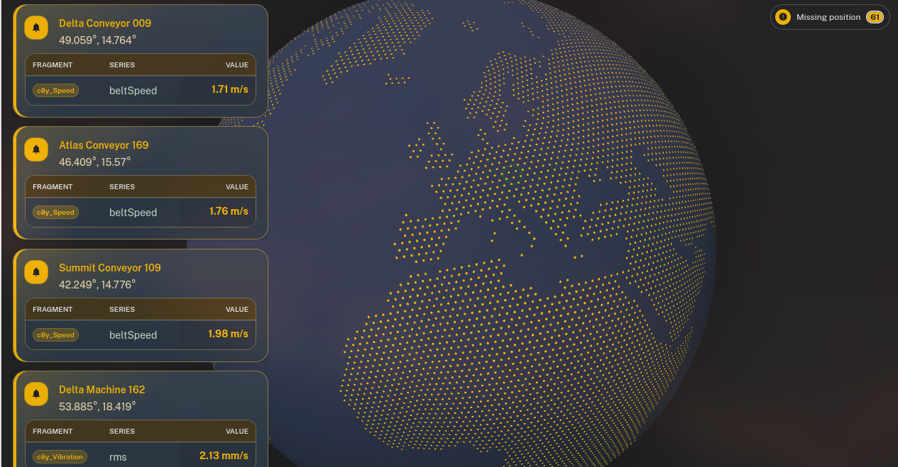

# realtime-globe

3D realtime measurement visualisation for Cumulocity dashboards.

realtime-globe is a Cumulocity IoT dashboard widget that renders an interactive globe, resolves the selected dashboard target at runtime, and turns incoming measurements into animated geographic ripple events.

<p align="center">
    
</p>

## Highlights

- Interactive 3D globe powered by `@event-globe/ts`
- Realtime ripple playback for incoming measurements with valid `c8y_Position` coordinates
- Live notification feed with device link, coordinates, and detected fragment/series values
- Runtime target resolution for a single device, group, or asset hierarchy
- Preview-first widget configuration with instant visual feedback
- Tenant-themed defaults backed by Cumulocity CSS custom properties
- Appearance overrides for teams that need per-widget tuning

## How it works

The widget uses the dashboard target selected by the standard Cumulocity framework.

- If the target is a device, the widget subscribes to that one managed object.
- If the target is a group or asset, the widget loads descendants in batches and subscribes only to managed objects with numeric `c8y_Position.lat` and `c8y_Position.lng` values.
- Incoming measurements are queued and played back as animated ripple events on the globe.
- Each event also creates a short-lived notification card in the top-left corner.

Managed objects without `c8y_Position` are intentionally excluded from ripple rendering and realtime subscription playback.

## Feature Set

### Globe experience

- Standalone renderer-backed globe view
- Hex-style land polygons, atmosphere glow, and optional auto-rotation
- Tenant-aware default colors with sensible fallbacks

### Realtime playback

- Measurement-driven ripple animation
- Configurable playback debounce for event pacing
- Configurable queue size for burst handling
- Configurable notification card timeout

### Configuration preview

- Sample ripple events in the widget config preview
- Immediate visual feedback while tuning appearance
- Slim config surface focused on presentation rather than source selection

## Configuration

The widget currently exposes the following configuration options:

| Field                  | Description                                              |
| ---------------------- | -------------------------------------------------------- |
| Scene background color | Optional override for the scene background               |
| Globe surface color    | Optional override for the globe material                 |
| Emissive color         | Optional override for globe emissive lighting            |
| Atmosphere color       | Optional override for the glow around the globe          |
| Land polygon color     | Optional override for land hexagons                      |
| Ripple color           | Optional override for preview and realtime ripple events |
| Auto-rotate            | Enables or disables idle globe rotation                  |
| Auto-rotate speed      | Controls idle rotation speed                             |
| Ripple max scale       | Sets the final size of ripple animations                 |
| Ripple expansion speed | Controls ripple animation growth                         |
| Measurement debounce   | Playback interval between queued measurement events      |
| Queue size             | Maximum queued measurement events kept in memory         |
| Card timeout           | How long measurement notification cards stay visible     |

Leaving a color field empty keeps the tenant branding defaults:

- `--c8y-palette-gray-10` for the scene background
- `--c8y-palette-gray-30` for the globe surface
- `--c8y-palette-gray-20` for emissive and atmosphere glow
- `--c8y-palette-yellow-60` for land polygons
- `--c8y-brand-primary` for ripple events, with a green fallback

## Development

```sh
pnpm install
pnpm start
pnpm build
pnpm lint
```

## Repository

<https://github.com/schplitt/realtime-globe>
